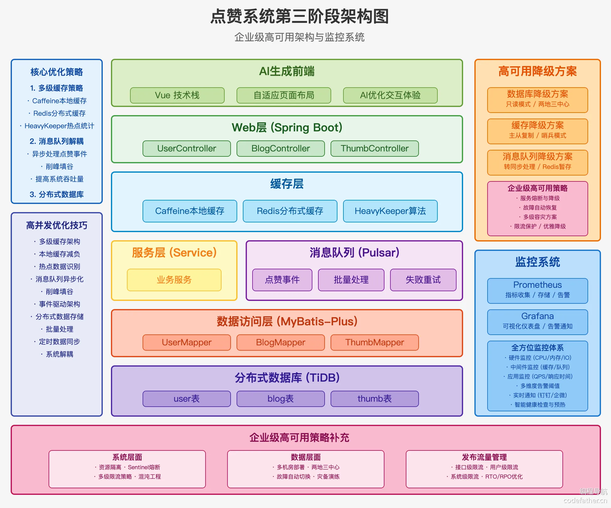

# ThumbSys - 高性能点赞系统

ThumbSys 是一个基于 Spring Boot 的高性能点赞系统，专注于解决高并发场景下的点赞功能实现。项目通过多级缓存、消息队列等技术，实现了从基础功能到性能优化的全方位解决方案。

## 项目特点

- **多级缓存架构**：本地缓存(Caffeine) + 分布式缓存(Redis) + 数据库(MySQL/TiDB)
- **消息队列解耦**：使用 Apache Pulsar 实现点赞操作异步处理
- **热点识别**：自研 HeavyKeeper 算法实现热点数据识别
- **高性能设计**：批量处理、定时任务、异步处理多种性能优化手段
- **高可用方案**：完整的多级降级和容错策略
- **可观测性**：集成 Prometheus + Grafana 监控方案

## 架构设计

### 基础功能模块

- 用户模块：简化的用户登录和会话管理
- 点赞模块：点赞、取消点赞功能实现
- 博客模块：作为点赞载体的内容管理模块

### 多级缓存架构


1. **本地缓存层(Caffeine)**：存储热点数据，减轻 Redis 压力
2. **分布式缓存层(Redis)**：存储用户点赞记录和临时点赞数据
3. **数据库层(MySQL/TiDB)**：持久化存储点赞数据

## 核心优化方案

### 优化 1：Redis 缓存替代查询

- 通过 Redis 缓存用户点赞记录，减少数据库查询
- 实现冷热数据分离，优化缓存效率

### 优化 2：批量处理点赞操作

- 将离散的点赞操作聚合为批量操作
- 通过定时任务同步缓存数据到数据库
- 兜底定时任务确保数据最终一致性

### 优化 3：本地缓存分担 Redis 压力

- 自研 HeavyKeeper 算法识别热点 Key
  
- 本地缓存热点数据，减轻 Redis 负载

### 优化 4：消息队列实现异步处理

- 引入 Apache Pulsar 解耦点赞操作与数据处理
- 实现消息重试和死信队列保障可靠性
- 定期对账机制确保数据一致性

### 优化 5：分布式数据库方案

- 使用 TiDB 替代传统 MySQL 提升可扩展性

## 高可用设计

### 数据库高可用

- 多中心部署，实现跨区域容灾
- 主备架构 + 读写分离 + 自动故障转移

### 缓存高可用

- Redis 集群方案
- 布隆过滤器防护机制

### 消息队列高可用

- 消息队列降级策略
- Redis 暂存+定时任务的备选方案

### 应用层高可用

- 限流、降级、熔断机制
- 使用 Sentinel 实现服务调用熔断保护

## 性能测试

### 测试环境

- 硬件配置：32G 内存、10 核 CPU
- 网络环境：百兆带宽
- 测试工具：Apache JMeter 5.6.3
- 并发配置：
  - 线程数：5010 个/组
  - 启动时长：5 秒
  - 循环次数：10 组
  - 总请求数：50100 次
- 测试接口：点赞接口
- 测试数据：50000 个不同用户，模拟对同一博客进行点赞

### 测试方法

1. 使用 JMeter 模拟多用户并发请求
2. 通过 CSV 文件导入 50000 个用户的会话信息
3. 对不同优化版本进行对比测试
4. 保证测试基准：接口异常率 0%

### 测试结果

| 优化版本           | TPS(每秒事务数) | 平均响应时间 | 最大响应时间 | 说明                                     |
| ------------------ | --------------- | ------------ | ------------ | ---------------------------------------- |
| 基础实现(仅 MySQL) | 358.8/s         | 12.6s        | 26.1s        | 出现异常，不适合高并发场景               |
| Redis 校验优化     | 3113.3/s        | 1.5s         | 3.2s         | 已点赞请求性能显著提升                   |
| Redis 替代数据库   | 5311.7/s        | 0.9s         | 2.1s         | 最佳性能表现，通过定时任务保证数据一致性 |
| 消息队列方案       | 3500/s          | 1.2s         | 2.8s         | 提供更好的系统稳定性和扩展性             |

### 性能分析

1. **基础实现版本**

   - 直接操作 MySQL 导致性能瓶颈
   - 高并发下响应时间显著增加
   - 存在数据库热点更新问题

2. **Redis 校验优化**

   - 显著提升已点赞用户的请求性能
   - 减少了重复点赞的数据库操作
   - 写操作仍然是性能瓶颈

3. **Redis 替代数据库**

   - 最优的性能表现
   - 通过定时任务批量同步保证数据一致性
   - 适合高并发写入场景

4. **消息队列方案**
   - 性能略低于纯 Redis 方案
   - 提供更好的系统稳定性
   - 优势：
     - 削峰填谷，平滑流量峰值
     - 解耦点赞操作和数据处理
     - 便于功能扩展（如消息通知）
     - 实时数据同步，无需依赖定时任务

### 测试结论

1. Redis 优化对性能提升显著，特别是在处理重复点赞请求时
2. 消息队列虽然性能略低，但提供了更好的系统可靠性和扩展性
3. 不同方案各有优劣，应根据实际业务场景选择：
   - 并发量低：基础 MySQL 方案足够
   - 高并发写入：Redis 方案性能最优
   - 需要可靠性和扩展性：消息队列方案更适合

## 技术栈

- **后端框架**：Spring Boot 3.4.4 + Java 21
- **ORM 框架**：MyBatis-Plus
- **缓存**：Redis + Caffeine
- **消息队列**：Apache Pulsar
- **数据库**：MySQL / TiDB
- **监控**：Prometheus + Grafana
- **API 文档**：Knife4j (Swagger 增强)
- **工具库**：Hutool, Lombok

## 构建与运行

### 环境要求

- JDK 21+
- Maven 3.8+
- Redis 7.0+
- MySQL 8.0+ 或 TiDB
- Apache Pulsar 2.10+

### 快速开始

1. 克隆项目

```bash
git clone https://github.com/xtyooo/ThumbSys.git
cd ThumbSys
```

2. 配置数据库

```bash
# 执行SQL脚本
mysql -u username -p < sql/schema.sql
```

3. 配置 application.yml

```yaml
# 配置数据库连接、Redis连接、Pulsar连接等
```

4. 编译运行

```bash
mvn clean package
java -jar target/ThumbSys-0.0.1-SNAPSHOT.jar
```

## 接口文档

启动项目后，访问：http://localhost:8080/doc.html 查看 API 文档

## 贡献指南

1. Fork 本仓库
2. 创建特性分支 (`git checkout -b feature/amazing-feature`)
3. 提交更改 (`git commit -m 'Add some amazing feature'`)
4. 推送到分支 (`git push origin feature/amazing-feature`)
5. 开启 Pull Request

## 许可证

MIT License

## 联系方式

- 作者：xtyooo
- 邮箱：[1286214601@qq.com]
- GitHub：[https://github.com/xtyooo](https://github.com/xtyooo)
